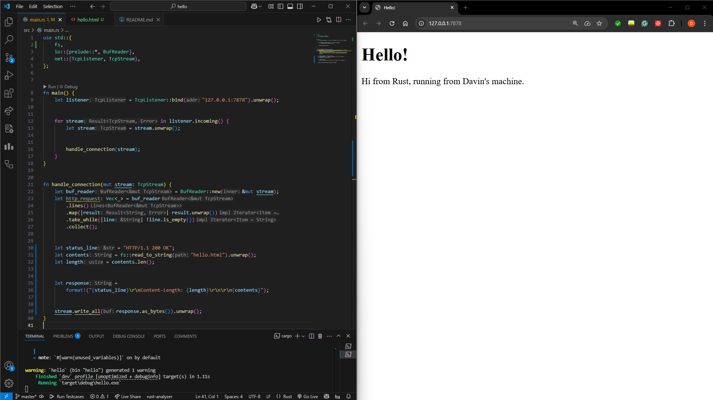

<h2> 1st Reflection </h2>

The function handle_connection will first take a TCP stream as an input. this represents an active connection from a web browser sending a HTTP request. Then it will wrap the incoming stream which has been set to mut or mutable with a buffered reader. This will buffer the input and should reduce the amount of system calls needed. Since the stream has been wrapped in a buffer it is possible to read the content per line using .lines() on the buffered reader. We then use `.map(|result| result.unwrap())` to unwrap everyting and handle the `Result` type. This is only possible if we assume reading all lines suceeded. We only ever stop reading based off `.take_while(|line| !line.is_empty())` which means we keep reading until there are no more lines to read so the of the end of the HTTP header section. Then use `.collect()` to gather all read lines and store it in a `Vec<String>` and finally print everything in a formatted print using `println!("Request: {:#?}", http_request);`.

<h2> 2nd Reflection </h2>

It uses the same method as before the `handle_connection()`. The difference is after it reads the request it will now create a HTTP resposne that has a status line for the version, code, and message. The length of the content sent or content-length which details the length of the content. Finally the actual HTML that will be accepted by the browser.

The way this is achieved is by first taking the different elements and saving them as different string variables. Using String formatting it will format the string and the code should send it back to the stream as bytes and allow the browser to render the data.

