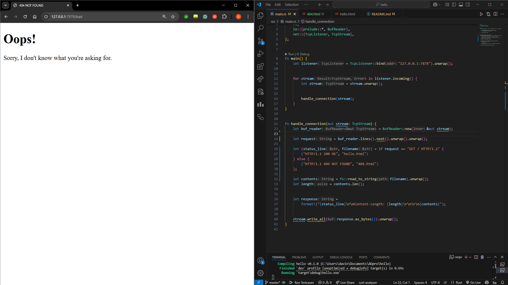

<h2> 1st Reflection </h2>

The function handle_connection will first take a TCP stream as an input. this represents an active connection from a web browser sending a HTTP request. Then it will wrap the incoming stream which has been set to mut or mutable with a buffered reader. This will buffer the input and should reduce the amount of system calls needed. Since the stream has been wrapped in a buffer it is possible to read the content per line using .lines() on the buffered reader. We then use `.map(|result| result.unwrap())` to unwrap everyting and handle the `Result` type. This is only possible if we assume reading all lines suceeded. We only ever stop reading based off `.take_while(|line| !line.is_empty())` which means we keep reading until there are no more lines to read so the of the end of the HTTP header section. Then use `.collect()` to gather all read lines and store it in a `Vec<String>` and finally print everything in a formatted print using `println!("Request: {:#?}", http_request);`.

<h2> 2nd Reflection </h2>

It uses the same method as before the `handle_connection()`. The difference is after it reads the request it will now create a HTTP resposne that has a status line for the version, code, and message. The length of the content sent or content-length which details the length of the content. Finally the actual HTML that will be accepted by the browser.

The way this is achieved is by first taking the different elements and saving them as different string variables. Using String formatting it will format the string and the code should send it back to the stream as bytes and allow the browser to render the data.

<h2> 3rd Reflection </h2>

Basically the goal to validating is to check the status line. In this line there is a section called the URI which should be the second parameter of the status line in a request. It contains the content of the URL after the infor regarding the destination of the request. We will apply the URI to differentaite the differet types of requests that is being sent. Here we are checkign ot `GET / HTTP/1.1` if it is that we send the hello.html anything else would be a 404 not found. So we are actually more effective in checkign and creating the filename since we only need to know whether it is a valid request or not instead of checking each request.

<h2>Reflection 4</h2>

So after running and observing the code I saw that the default redirect to the hello.html was very slow. This is because the code was calling a sleep which was taking the resources and therefore, it placed my original request in the queue waiting for the sleep to finish. This causes a delay or causes the loading to be slow since the program will wait for the sleep to finish before allowing the other requests to finish.

<h2> Reflection 5 </h2>

Here using a multithread into the application actually improved the performance of the overall application since using this code and library actually created workers. What they help achieve is the distribution of requests, basically by allowing new workers we create many more slots for a request to take and thus we do not need to wait for the sleep to finish.

The process to allow this to work is first creating a passing channel for each thread. Then the threadpool should create a vector of `workers` who will each create a thread. Each worker can only ever work on one request since after it gets a request it will lock until the job is done.

Each input needs to be a function that will be put into a box and given to the worker. In this code there are 4 workers and whenever we get a stream from the TCPListener it will execute the ThreadPool and the handle_connection.

<h2> Bonus Reflection </h2>

So instead of using the `new()` function I changed it to use the `build()` function. The main reason for doing so was to help handle more complext tasks. While both functions achieve the same thing build helps direct to more expanded library which in this case allows us to create multi-threaded programs. In doing so we allow the function to properly direct itself and create a more complex and configured setup.